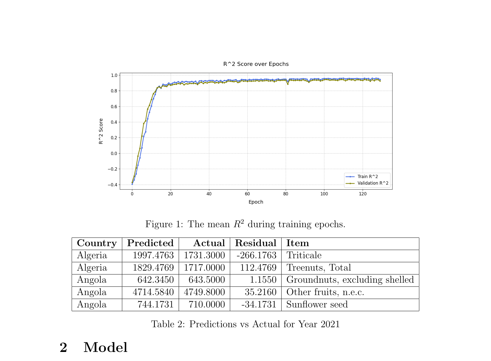
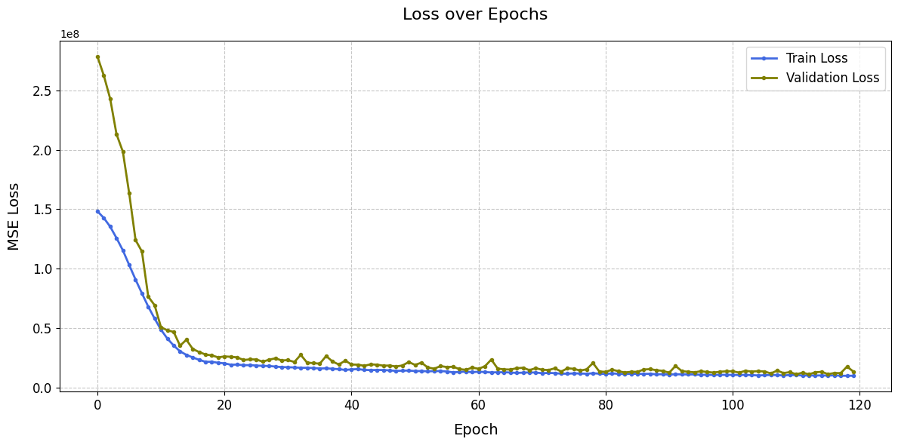
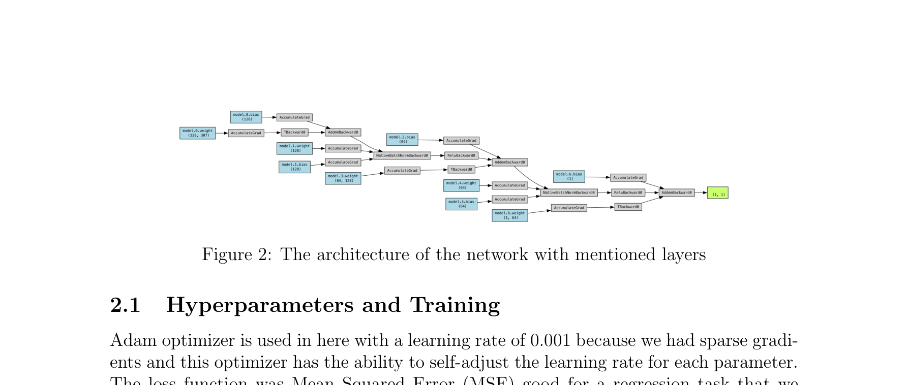

# Global Crop Yield Forecasting with MLP Neural Network

[](https://www.python.org/)
[](https://pytorch.org/)
[](https://scikit-learn.org/)
[](LICENSE)
[]()
[]()

> A PyTorch **Multilayer Perceptron (MLP)** that forecasts crop yield (kg/ha) one year ahead for **165 countries** and **102 crop types**, trained on multi-source climate, soil, and land-cover data spanning 2010–2022. Achieves **R² = 0.9452** and **Pearson r = 0.9681** on unseen validation years (2020–2021).

---

## Results at a Glance

| Metric | Value |
|---|---|
| Validation R² | **0.9452** |
| Validation Pearson r | **0.9681** |
| Validation RMSE | **3926.49 kg/ha** |
| Validation MSE | **1.54 × 10⁷** |
| Training MSE | **9.62 × 10⁶** |
| Training samples | **52,370** |
| Validation samples | **10,368** |
| Prediction samples (2022) | **5,190** |
| Countries | **165** |
| Crop types | **102** |
| Input features (post-encoding) | **43** |
| Epochs | **120** |

---

## Highlights

- **Temporal train/val split** — no data leakage; model trained on 2010–2019, validated on 2020–2021, deployed on 2022
- **Exponential decay weighting** — recent years contribute more to weight updates via `w = e^(−λ · year_diff)`, λ = 0.1
- **Multi-source feature engineering** — 30+ raw climate variables collapsed into meaningful annual summaries (mean, min, max, sum)
- **Haversine-based geo-matching** — satellite grid points assigned to countries using great-circle distance with centroid radius logic
- **Log-space target** — `log(1 + yield)` applied before training, back-transformed before evaluation to handle skewed kg/ha values
- **BatchNorm over Dropout** — empirically found batch normalisation sufficient to prevent overfitting without dropout

---

## Training Curves

The model converges rapidly in the first 20 epochs. Both train and validation R² exceed 0.94 and plateau after epoch ~80, confirming stable generalisation with no overfitting.

**R² Score over Epochs**


**Loss (MSE) over Epochs**


---

## Architecture



The network is a fully-connected feed-forward MLP:

```
Input  →  [Linear(d → 128) → BatchNorm → ReLU]
       →  [Linear(128 → 64)  → BatchNorm → ReLU]
       →  Linear(64 → 1)
       →  Predicted Yield (kg/ha)
```

| Component | Detail |
|---|---|
| Input layer | d-dimensional feature vector (numeric + one-hot) |
| Hidden layer 1 | Linear → BatchNorm(128) → ReLU |
| Hidden layer 2 | Linear → BatchNorm(64) → ReLU |
| Output layer | Linear → scalar (log-yield) |
| Optimizer | Adam, lr = 0.001 |
| Loss function | Weighted MSE |
| Batch size | 64 |
| Epochs | 120 |

**Why no Dropout?** After extensive experimentation, BatchNorm alone prevented overfitting. Dropout introduced unnecessary variance with no measurable regularisation gain on this dataset.

---

## Sample Predictions vs Ground Truth (2021)

A snapshot of model predictions against true yield values for the 2021 validation year. Predictions are back-transformed from log-space to the original kg/ha scale before comparison.

| Country | Predicted (kg/ha) | Actual (kg/ha) | Residual | Crop |
|---|---|---|---|---|
| Algeria | 1997.48 | 1731.30 | -266.18 | Triticale |
| Algeria | 1829.48 | 1717.00 | +112.48 | Treenuts, Total |
| Angola | 642.35 | 643.50 | +1.16 | Groundnuts, excl. shelled |
| Angola | 4714.58 | 4749.80 | +35.22 | Other fruits, n.e.c. |
| Angola | 744.17 | 710.00 | -34.17 | Sunflower seed |

The `predictions_2022.csv` file in this repo contains model predictions for the **2022 forecast year** alongside true values for all 5,190 country–crop pairs.

---

## Dataset & Features

The model uses **multi-source earth observation data** merged at the country–year level:

### Climate Variables (monthly → annual aggregation)

| Feature Group | Variables | Aggregation |
|---|---|---|
| **Soil Moisture** | 0–10 cm, 10–40 cm, 40–100 cm, 100–200 cm | Annual mean |
| **Soil Temperature** | 4 depths × (mean, min, max) = 12 columns | Annual mean/min/max |
| **Evaporation (ESoil)** | ESoil_tavg | Annual mean |
| **Transpiration (TVeg)** | TVeg_tavg | Annual mean |
| **Canopy Water** | CanopInt | Annual mean |
| **Terrestrial Water Storage** | TWS anomaly | Annual mean |
| **Precipitation – Rain** | Rainf_tavg | Annual total (mm) |
| **Precipitation – Snow** | Snowf_tavg | Annual total (mm) |
| **Land Cover** | 17 land-use class percentages | Per-country mean |

### Categorical Variables

| Feature | Detail |
|---|---|
| Country | One-hot encoded (165 countries) |
| Crop Item | One-hot encoded (102 crop types) |
| Year | Numeric (2010–2022) |

### Target (Label)

> **Yield** (kg/ha) for year *T+1* — features from year *T* are paired with the yield from year *T+1* by decrementing the yield year by 1 before merging.

---

## Preprocessing Pipeline

A production-grade preprocessing pipeline was built entirely from scratch:

### 1. Missing Value Imputation

| Variable | Strategy |
|---|---|
| TWS month 2 & 3 (~14,946 rows) | Weighted linear interpolation: `⅔ × Jan + ⅓ × Apr` |
| Soil Moisture 100–200cm month 8 | Average of month 7 (July) and month 9 (September) |
| Country lat/long nulls (7 rows) | Dropped — insufficient coverage data |

### 2. Unit Conversions

| Variable | From | To | Method |
|---|---|---|---|
| Precipitation | kg/m²/s | mm/month | × seconds/month ÷ 1000 |
| Soil Temperature | Kelvin | °Celsius | − 273.15 |
| Yield | raw kg/ha | log-scale | log(1 + x) |

### 3. Geo-Assignment — Haversine Matching

Each satellite grid point (lat, lon) was assigned to a country using the **Haversine formula** to compute great-circle distance to each country centroid. Points falling within a country's radius boundary were assigned to the closest centroid. Edge cases were resolved by choosing the country whose border was nearest.

### 4. Feature Engineering

Monthly time-series columns were collapsed into annual summaries:
- **Mean** — used for soil moisture, soil temperature, ESoil, TVeg, canopy water, TWS
- **Sum** — used for precipitation (total annual rainfall/snowfall matters more than rate)
- **Min + Max** — added for soil temperature to capture seasonal extremes (overwintering stress, heat stress)

### 5. Scaling & Encoding

```
Numeric features  →  StandardScaler (zero mean, unit variance)
Categorical       →  OneHotEncoder (ignore unseen categories)
Combined via      →  ColumnTransformer (sklearn Pipeline)
```

### 6. Exponential Decay Weighting

To emphasise more recent agricultural patterns (e.g., climate shifts post-2015):

```
weight = exp(−λ × (target_year − sample_year)),   λ = 0.1
```

Samples from 2019 receive weight ≈ 1.0; samples from 2010 receive weight ≈ 0.41. These weights are passed directly to the loss function per batch.

---

## How to Run

### 1. Clone the repository

```bash
git clone https://github.com/alinjfz/crop-yield-forecasting-mlp-pytorch.git
cd crop-yield-forecasting-mlp-pytorch
```

### 2. Install dependencies

```bash
pip install torch scikit-learn pandas numpy matplotlib tqdm
```

### 3. Add the raw dataset

Place the raw dataset files (soil, weather, land cover, yield CSVs) in a `data/raw/` directory. The notebook documents each expected filename at the top of each preprocessing cell.

### 4. Run the notebook

```bash
jupyter notebook crop_yield_forecasting.ipynb
```

The notebook is structured sequentially:
1. **Preprocessing** — imputation, unit conversion, merging, geo-assignment
2. **Feature engineering** — annual aggregation, decay weights, train/val split
3. **Model definition & training** — MLP with BatchNorm, Adam, weighted MSE
4. **Evaluation** — R², Pearson r, RMSE on validation set (2020–2021)
5. **2022 Forecasting** — generates `predictions_2022.csv`

---

## Repository Structure

```
crop-yield-forecasting-mlp-pytorch/
├── crop_yield_forecasting.ipynb   # Full pipeline: preprocessing → training → prediction
├── predictions_2022.csv           # Model output: Country, Item, True_Value, Predicted_Value
├── report.pdf                     # Technical report with full methodology
├── assets/
│   ├── r2_training_curve.png      # R² score over 120 training epochs
│   ├── loss_over_epochs.png       # MSE loss over 120 training epochs
│   ├── network_architecture.png   # MLP layer diagram
│   └── report_title.png           # Report cover page
└── LICENSE
```

---

## Tech Stack

| Tool | Role |
|---|---|
| **PyTorch** | MLP model definition, custom training loop, weighted loss |
| **scikit-learn** | ColumnTransformer, StandardScaler, OneHotEncoder, SimpleImputer |
| **pandas** | Data loading, merging, groupby aggregation |
| **NumPy** | Haversine distance computation, array operations |
| **Matplotlib** | Training curve visualisation |
| **tqdm** | Epoch progress monitoring |

---

## Why This Problem is Hard

- **165 countries × 102 crops** — the model must generalise across radically different climates and crop types simultaneously
- **No random split** — temporal splitting (train ≤ 2019, val 2020–2021) forces genuine forecasting with no future leakage
- **Multi-source heterogeneous data** — merging satellite climate grids, yield statistics, and land-cover maps required custom geo-matching logic
- **Sparse targets** — not every country grows every crop, creating a non-uniform label space
- **Scale variance** — yields range from tens to hundreds of thousands of kg/ha depending on crop type, making log-transformation critical

---

## Author

**Ali Najafzadeh**
MSc Artificial Intelligence — University of Sussex
[GitHub](https://github.com/alinjfz) · [LinkedIn](https://linkedin.com/in/alinajafzadeh)

---

## License

This project is licensed under the MIT License. See [LICENSE](LICENSE) for details.
